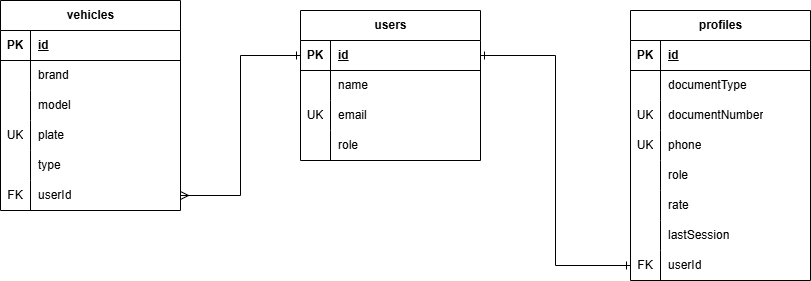
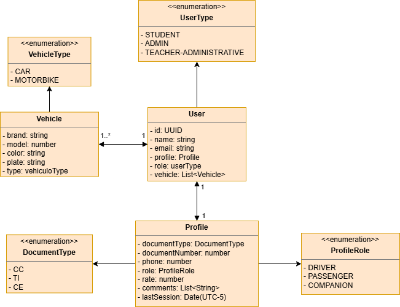

# 🔐 Sonic User Service

Microservicio REST para la gestión de autenticación, perfiles y administración institucional, parte de la plataforma **RIDECI LEGACY**.

Construido con **NestJS**, **PostgreSQL** (a través de Prisma ORM) y **Supabase** para la autenticación externa.

---

# 🛠️ Tecnologías Principales

| Tecnología                          | Uso                                 |
| ----------------------------------- | ----------------------------------- |
| 🚀 NestJS 11                        | Framework principal                 |
| 🗄️ PostgreSQL + Prisma 7           | Base de datos y ORM                 |
| 🔑 Supabase (supabase-js)          | Autenticación externa               |
| ✅ class-validator / class-transformer | Validación de DTOs              |

---

# 🏗️ Arquitectura

El servicio implementa una **arquitectura modular** que organiza la lógica por dominios de negocio.

```text
src/
├── auth/                 # 🔐 Autenticación (registro e inicio de sesión)
├── users/                # 👤 Gestión de usuarios institucionales
├── profile/              # 📋 Perfiles de usuario y reputación
├── admin/                # 🛡️ Administración institucional
├── vehicles/             # 🚗 Gestión de vehículos
├── supabase/             # 🔗 Integración con Supabase Auth
├── prisma/               # 🗄️ Cliente Prisma ORM
└── main.ts               # 🚀 Punto de entrada
```

---

# ⚙️ Variables de Entorno

Crea un archivo `.env` en la raíz del proyecto usando `.env.example` como referencia:

```env
DATABASE_URL="postgresql://<usuario>:<password>@<host>:<puerto>/<database>"
SUPABASE_URL="https://<proyecto>.supabase.co"
SECRET_KEY="<clave-secreta>"
PORT="3000"
```

---

# 🚀 Instalación y Ejecución

## 📋 Prerequisitos

- Node.js 18 o superior
- pnpm
- PostgreSQL (local o remoto)
- Supabase (cuenta y proyecto)

---

## 1️⃣ Clonar el repositorio

```bash
git clone <url-del-repositorio>
cd sonic-user-service
```

## 2️⃣ Instalar dependencias

```bash
pnpm install
```

## 3️⃣ Configurar variables de entorno

```bash
cp .env.example .env
```

Editar el archivo `.env` con las credenciales correspondientes.

## 4️⃣ Generar cliente Prisma

```bash
pnpm exec prisma generate
```

## 5️⃣ Ejecutar las migraciones

```bash
pnpm exec prisma migrate dev
```

## 6️⃣ Ejecutar el servicio

### 🔥 Desarrollo

```bash
pnpm run start:dev
```

### 📦 Producción

```bash
pnpm run build
pnpm run start:prod
```

---

## ✅ Verificar funcionamiento

| Recurso        | URL                                |
| -------------- | ---------------------------------- |
| 🌐 API         | `http://localhost:{PORT}`          |
| 📖 Swagger UI  | *Próximamente*                     |
| 📈 Métricas    | *Próximamente*                     |

---

# 🛣️ Endpoints

## 🔐 Auth

**Base URL:** `/auth`

| Método | Endpoint            | Descripción              |
| ------ | ------------------- | ------------------------ |
| 📝 POST | `/auth/sign-up`    | Registrar nuevo usuario  |
| 🔑 POST | `/auth/sign-in`    | Iniciar sesión           |

## 👤 Users

**Base URL:** `/users`

| Método | Endpoint       | Descripción                |
| ------ | -------------- | -------------------------- |
| ➕ POST | `/users`       | Crear un usuario           |
| 📋 GET  | `/users`       | Obtener todos los usuarios |
| 🔍 GET  | `/users/:id`   | Obtener usuario por ID     |
| ✏️ PATCH | `/users/:id`  | Actualizar usuario         |
| ❌ DELETE | `/users/:id` | Eliminar usuario           |

## 📋 Profile

**Base URL:** `/profile`

| Método | Endpoint          | Descripción                |
| ------ | ----------------- | -------------------------- |
| ➕ POST | `/profile`        | Crear un perfil            |
| 📋 GET  | `/profile`        | Obtener todos los perfiles |
| 🔍 GET  | `/profile/:id`    | Obtener perfil por ID      |
| ✏️ PATCH | `/profile/:id`   | Actualizar perfil          |
| ❌ DELETE | `/profile/:id`  | Eliminar perfil            |

## 🛡️ Admin

**Base URL:** `/admin`

| Método | Endpoint         | Descripción                     |
| ------ | ---------------- | ------------------------------- |
| ➕ POST | `/admin`         | Crear administrador             |
| 📋 GET  | `/admin`         | Obtener todos los administradores |
| 🔍 GET  | `/admin/:id`     | Obtener administrador por ID    |
| ✏️ PATCH | `/admin/:id`    | Actualizar administrador        |
| ❌ DELETE | `/admin/:id`   | Eliminar administrador          |

## 🚗 Vehicles

**Base URL:** `/vehicles`

| Método | Endpoint            | Descripción                  |
| ------ | ------------------- | ---------------------------- |
| ➕ POST | `/vehicles`         | Crear un vehículo            |
| 📋 GET  | `/vehicles`         | Obtener todos los vehículos  |
| 🔍 GET  | `/vehicles/:id`     | Obtener vehículo por ID      |
| ✏️ PATCH | `/vehicles/:id`    | Actualizar vehículo          |
| ❌ DELETE | `/vehicles/:id`   | Eliminar vehículo            |

## 🔗 Supabase

**Base URL:** `/supabase`

| Método | Endpoint     | Descripción              |
| ------ | ------------ | ------------------------ |
| ➕ POST | `/supabase`  | Crear cliente Supabase   |

---

# 📦 Modelos

## SignUpDto

```json
{
  "name": "Juan Pérez",
  "email": "juan.perez@institucion.edu",
  "password": "********",
  "documentType": "CC",
  "documentNumber": "1234567890"
}
```

## SignInDto

```json
{
  "email": "juan.perez@institucion.edu",
  "password": "********"
}
```

## CreateUserDto

```json
{
  "name": "Juan Pérez",
  "email": "juan.perez@institucion.edu",
  "role": "STUDENT"
}
```

## CreateProfileDto

```json
{
  "documentType": "CC",
  "documentNumber": "1234567890",
  "phone": "3001234567",
  "role": "DRIVER",
  "rate": 4.5,
  "lastSession": "2025-06-10T08:00:00.000Z",
  "userId": "uuid-del-usuario"
}
```

## CreateVehicleDto

```json
{
  "brand": "Mazda",
  "model": "2023",
  "plate": "ABC-123",
  "type": "CAR"
}
```

---

# 📑 Enumeraciones

| Campo         | Valores Permitidos                                      |
| ------------- | ------------------------------------------------------- |
| 👤 UserType   | `STUDENT` · `ADMIN` · `TEACHER_ADMINISTRATIVE`          |
| 🆔 DocumentType | `CC` · `TI` · `CE`                                    |
| 🎭 ProfileRole | `DRIVER` · `PASSENGER` · `COMPANION`                   |
| 🚘 VehicleType | `CAR` · `MOTORCYCLE`                                   |

---

# 📖 Documentación Swagger

*Próximamente — se integrará Swagger/OpenAPI para documentación interactiva de los endpoints.*

---

# 📊 Métricas

*Próximamente — se integrará Prometheus para monitoreo y métricas del servicio.*

---

# 📐 Diagramas

## Diagrama Entidad-Relación



## Diagrama de Clases



---

# 👥 Equipo de Desarrollo

- [@tulio3101](https://github.com/tulio3101) — Tulio Riaño Sánchez
- [@JuanTellez125](https://github.com/JuanTellez125) — Juan Esteban Tellez Valencia
